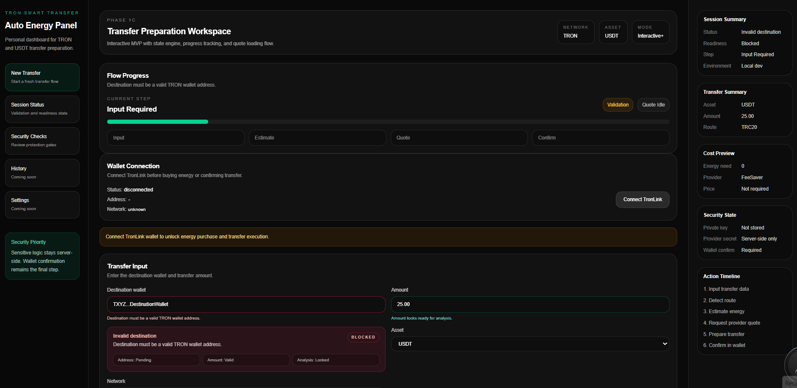

# ⚡ TRON Smart Transfer

End-to-end smart transaction system for TRON network.

---

## 🎥 Demo

  

---

## 🚀 Features

- Wallet connection flow
- Energy estimation engine
- Smart routing system
- Step-based execution pipeline

---

## 🧠 System Design

This project is not just a UI.

It simulates a real transaction pipeline:
Input → Validation → Energy Estimation → Routing → Execution

---

## 🛠 Tech Stack

Next.js • React • TypeScript • Tailwind

---

## 🎯 Goal

Building production-grade Web3 transaction systems.
